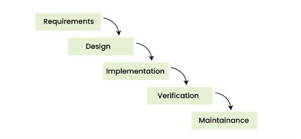

# Software Lifecycle

- peddhaga em undadhu, oka software ki end to end phases enti ane katha idhi
- basic ga 6 stages untai kindha raastha chudu

## Planning 
- project scope entha 
- ee project ki unna goals enti ivanni
- resource plans vestharu i.e., entha mandhi developers kavali aa workstations etc idhi antha

## Define Requirements
- Ikkada SRS documentation chuskuntaaru functional requirements enti technical requirements enti ani
- functional ante basic ga em em features ivaali, dhaani major tasks enti ani oka overall view
- technical ante quality based factors anamaata - ante performance entha, efficiency entha ala...

## Design
- First high level design chestharu - ante major ga project structure ela undaali major items ekkada ekkada pettali ani
- Low level design - ante inka koncham precise ga focus chestharu - like ee setting ela etc...

## Development
- ikkada first coding standards set chestaru, like ee lang use cheyyali ee framework avanni anamaata
- code scalability - ante ippudu raase code long term lo entha varaku work avtadhi ani assess chestharu
- version control - ante mundhu version lo emanna bugs kani improvements kani unte avi next version lo update chesi release chesthu untaru - adhe version control ante
- code review - ante optimizations, bug checks anni cover avthai ikkada

## Testing
- first system testing - ante present system lo anni basic things work avthunnaya ledha ani - like code run avthundha ledha ani check chestharu
- manual testing - ikkada developers ee inputs ichi check chesthu untaru - more like vella sontha testcases annattu
- indhulone two types of testing untayi - 
- black box testing - just pai paina functionality check chestharu - like buttons avanni nokki - ivi mostly oka chinna grp of actual users chestharu
- white box testing - ante ikkada malli code level lo testing and debugging chestharu - idhi developers chestharu

## Deployment and Maintenance
- ikkada basic ga eppudu release cheyyali ani plan chestaru
- okasari chesaaka basis bugs unte automation lo solve cheyyadam - emanna strange bugs unte appatiki appudu solve cheyyadam - basic ga devops chese pani antha

# SDLC Models
### ee stages gurthupettuko, tharvatha use avthai

## Waterfall model
- basic ga ikkada anni one by one avthai anamaata like requirements -> design -> impl.... ila
