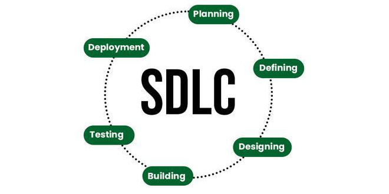

# Software Lifecycle

- peddhaga em undadhu, oka software ki end to end phases enti ane katha idhi
- basic ga 6 stages untai kindha raastha chudu

### Planning 
- project scope entha 
- ee project ki unna goals enti ivanni
- resource plans vestharu i.e., entha mandhi developers kavali aa workstations etc idhi antha

### Define Requirements
- Ikkada SRS documentation chuskuntaaru functional requirements enti technical requirements enti ani
- functional ante basic ga em em features ivaali, dhaani major tasks enti ani oka overall view
- technical ante quality based factors anamaata - ante performance entha, efficiency entha ala...
