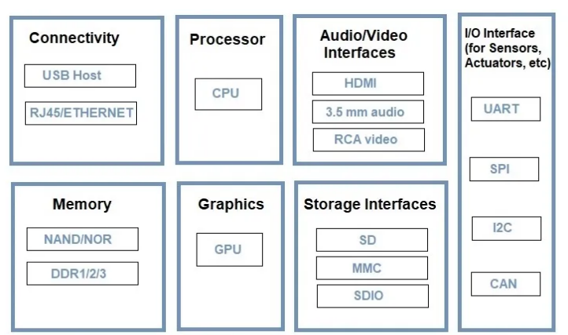
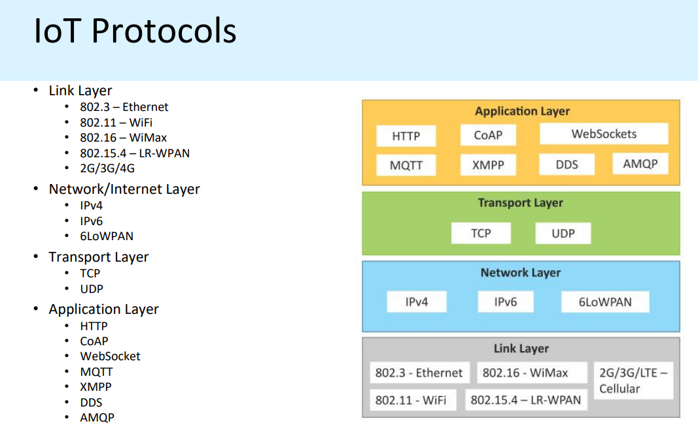
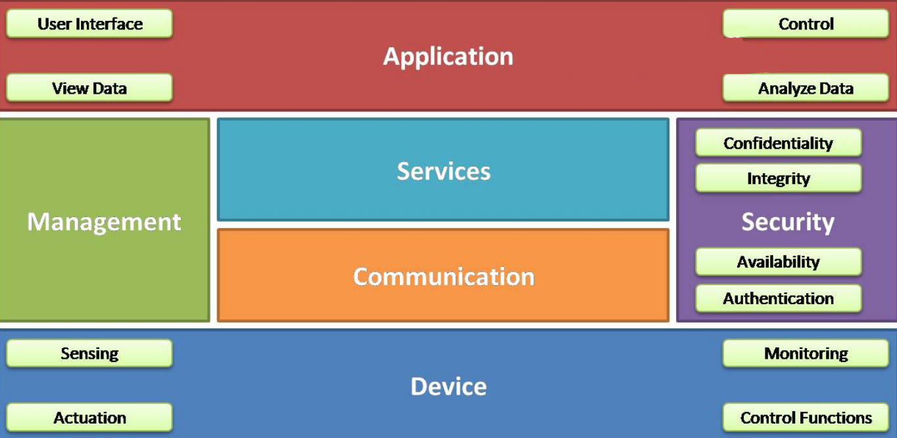
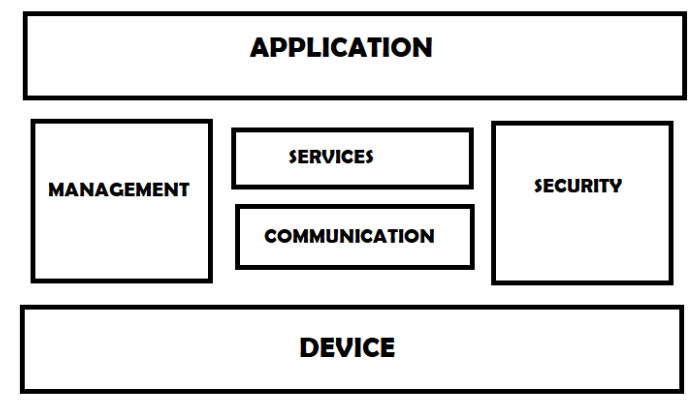
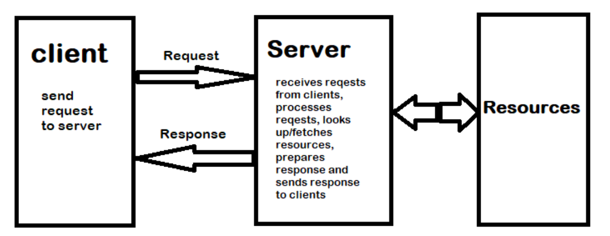
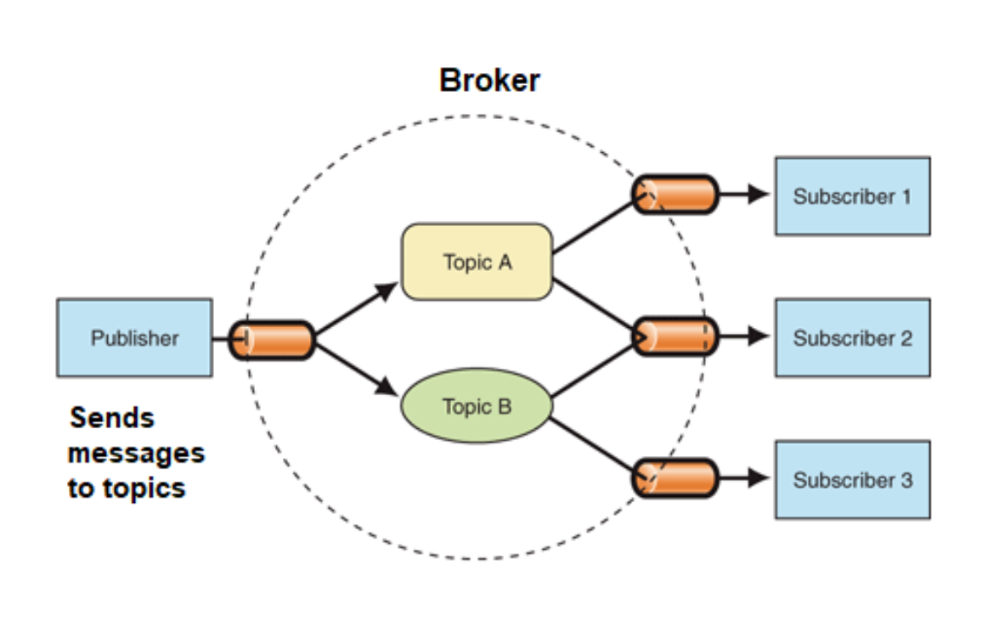
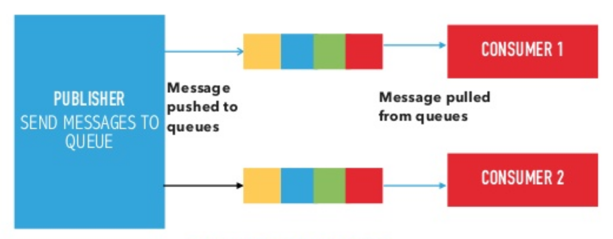
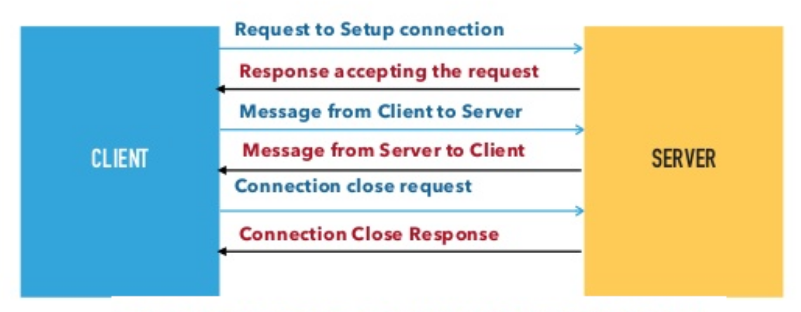
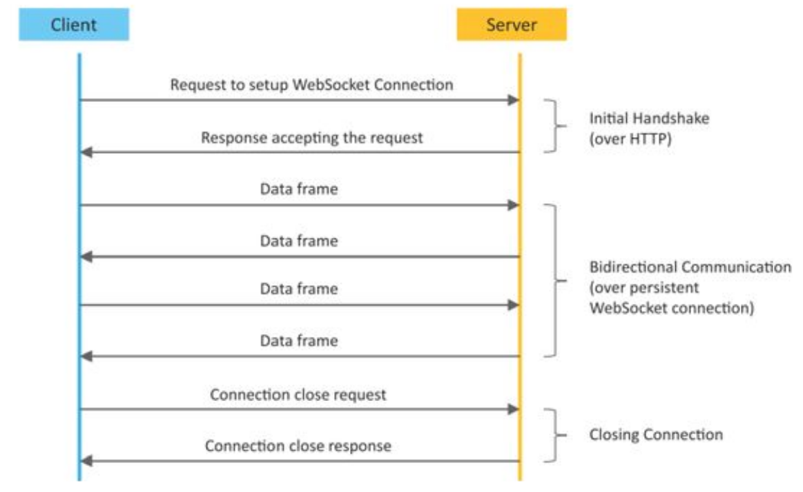

# IoT Notes for Midsem

## Contents

## [Unit 1](#s1)

### [Intro](#s2)

-   Definition: An interconnected network of devices that are embedded with sensors, actuators, their appropriate software and network connectivity.

### Characteristics:

-   Connectivity: Most common methods are BlueTooth, Wi-Fi and [RFID](<https://www.fda.gov/radiation-emitting-products/electromagnetic-compatibility-emc/radio-frequency-identification-rfid#:~:text=Radio%20Frequency%20Identification%20(RFID)%20refers,back%20from%20the%20RFID%20tag.>) which is also called as Radio Frequency Identification
-   Sensors and Actuators: Sensors collect and send data, actuators receive and operate according to given data
-   Automation: IoT devices enable automation by responding to certain conditions in real-life without human involvement.
-   Interoperability: IoT devices are bound to function accordingly despite originating from different manufacturers.
-   Energy Efficient: Most IoT devices perform robustly with consuming less power.

#### Structural Design

### Things in IoT

-   All the individual components in an IoT device are considered as things of IoT.

### Protocols in IoT

-   6LoWPAN - six - low - pan. Which means IPv6 protocol over low power.
-   HTTP - HyperText Transfer Protocol - Supports GET and POST methods for client-server based connection for data transfer, and it's lighter too.
-   CoAP - Co-nstrained Application Protocol - used for low power devices.
-   MQTT - Message Queueing Telemetry Transport - used for intercommunication using messages.
-   XMPP - Extensible Messaging and Prescence Protocol - supports instant messaging, group chats and a lightweight middleware for collaboration.
-   DDS - Data Distribution Service - For data exchange from machine to machine with a brokerless architecture like MQTT and CoAP protocols.
-   AMQP - Advanced Message Queueing Protocol - Supports asynchronous messaging with encryption, purpose stands for more complex networks.

### Logical Design of IoT

#### [ChatGPT](https://chat.openai.com/share/2e87725b-6175-467c-9c68-f76c4e58b429) link for this topic

### Functional Blocks of IoT

-   Device: An IoT system comprises of devices that provide sensing, actuation, monitoring and control functions.

-   Communication: Handles the communication for the IoT system.

-   Services: services for device monitoring, device control service, data publishing services and services for device discovery.

-   Management: this blocks provides various functions to govern the IoT system.

-   Security: this block secures the IoT system and by providing functions such as authentication , authorization, message and content integrity, and data security.

-   Application: This is an interface that the users can use to control and monitor various aspects of the IoT system. Application also allow users to view the system status and view or analyze the processed data.

## Functional Models of IoT

### Request Response Model

-   Request-response model is communication model in which the client sends requests to the server and the server responds to the requests.
-   When the server receives a request, it decides how to respond, fetches the data, retrieves resource representation, prepares the response, and then sends the response to the client.
-   Request-response is a stateless communication model and each request-response pair is independent of others.

### Publish Subscribe Model

-   Publish-Subscribe is a communication model that involves publishers, brokers and consumers.
-   Publishers are the source of data. Publishers send the data to the topics which are managed by the broker.
-   Publishers are not aware of the consumers. Consumers subscribe to the topics which are managed by the broker.
-   When the broker receive data for a topic from the publisher, it sends the data to all the subscribed consumers.

### Push-Pull Model

-   Push-Pull is a communication model in which the data producers push the data to queues and the consumers Pull the data from the Queues.
-   Producers do not need to be aware of the consumers. Queues help in decoupling the messaging between the Producers and Consumers.
-   Queues also act as a buffer which helps in situations when there is a mismatch between the rate at which the producers push data and the rate rate at which the consumer pull data.

### Exclusive Pair Communication Model

-   Exclusive Pair is a bidirectional, fully duplex communication model that uses a persistent connection between the client and server.
-   Connection is setup it remains open until the client sends a request to close the connection. Client and server can send messages to each other after connection setup.
-   Exclusive pair is stateful communication model and the server is aware of all the open connections.

## APIs in IoT

### REST-based Communication APIs

-   REST stands for Representational state transfer

### Architecture for REST API

#### Client-server:

The principle behind the client-server constraint is the separation of concerns. Separation allows client and server to be independently developed and updated.

#### Stateless:

Each request from client to server must contain all the information necessary to understand the request. The session state is kept entirely on the client.

#### Cache-able:

Cache constraints requires that the data within a response to a request be implicitly or explicitly leveled as cache-able or non cache-able.   
If a response is cache-able, then a client cache is given the right to reuse that repsonse data for later, equivalent requests. caching can partially or completely eliminate some instructions and improve efficiency and scalability.

#### Layered system:

Layered system constrains the behavior of components such that each component cannot see the next layer after them. For example, the client cannot tell whether it is connected directly to the end server or to an intermediary along the way.   
In this way, the system scalability can be improved.

#### Uniform interface:

-   It states that the communication medium between the server and client must be uniform
-   Resources are identified in the requests and are they are separate from the resources of data returned to the client.
-   When a client holds a representation of resources it has all the information required to update or delete the resources mentioned. Each message includes enough information to describe how to process the message.

#### Code on demand:

Servers can provide executable code or scripts for clients to execute in their context. this constraint is the only one that is optional.

### WebSocket based communication API

-   It is bi-directional and full duplex connection b/w client and server.
-   Unlike REST API, WebSocket does not require new connection for each new message.
-   The request (called websocket handshake) is sent over HTTP and the server interprets it is an upgrade request.
-   Websocket API reduces the network traffic and latency as there is no overhead for connection setup and termination requests for each message.

## IoT Enabling Technologies

### Wireless Sensor Network

-   It consists of end nodes, routers and coordinators.
-   Sensor collect the data and send it to the coordinators with the help of routers.
-   Example: Weather Forecast, AQI Monitor, Soil Moisture, Health Monitoring Systems.

### Cloud Computing

The ability of enabling utilites of applications over the internet.   

#### Characteristics:

-   Broad network access
-   On demand self-services
-   Rapid scalability
-   Measured service
-   Pay-per-use

#### Services: 
#### IaaS - Infrastructure as a service
- Provides servies like VMs, Compute Engines etc.,
#### PaaS - Platform as a service
- Platform to develop applications that consists of several libraries and hardware specifications like App Cloud, Google App Engine.
#### SaaS - Software as a service
- Providing softwares for uilitization like GMail, Office365 etc.,
## [Unit 2](#s3)
